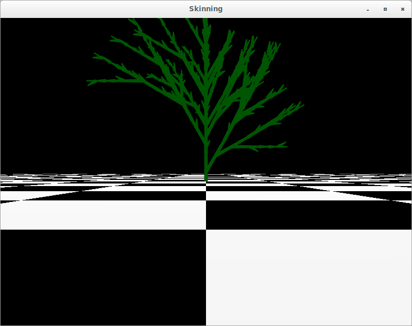
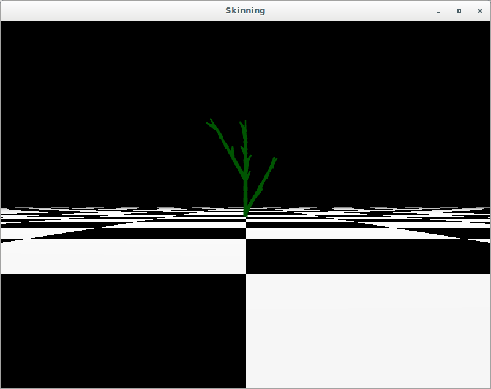
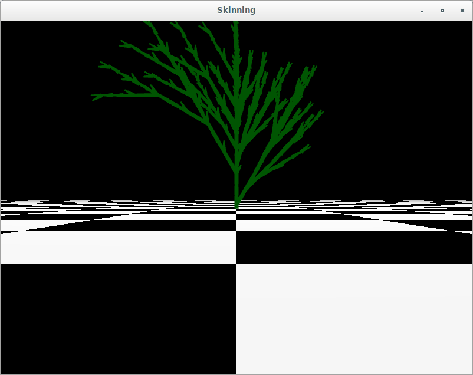
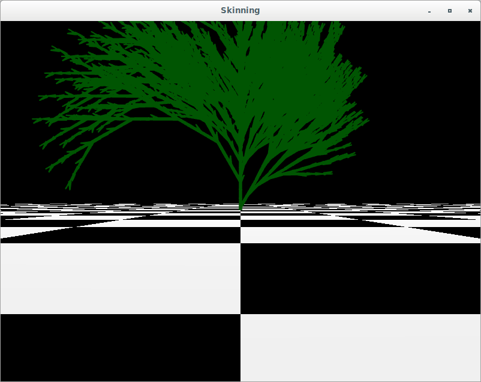
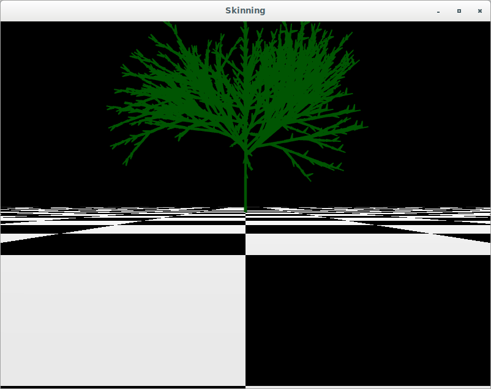
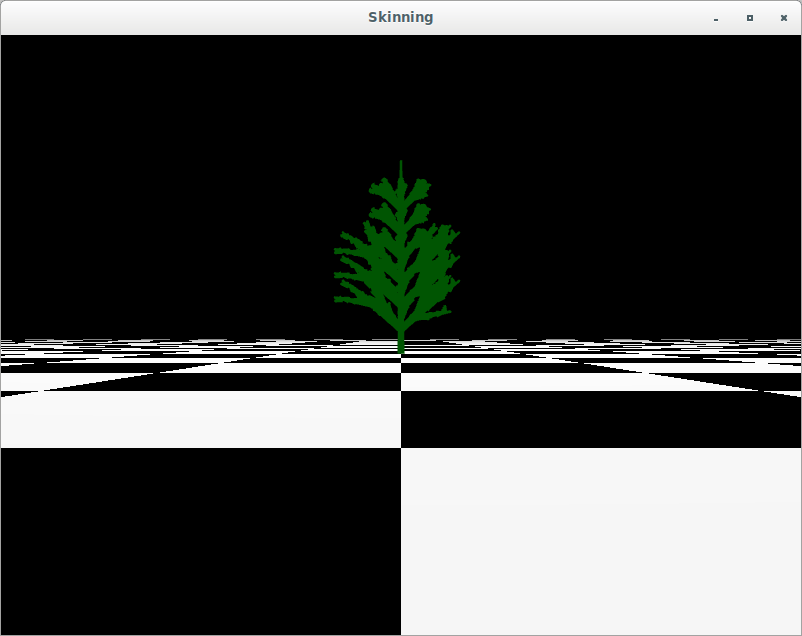

# Project background

## L-Systems introduction (Sonika, I can do this part)

## Alphabet (Sonika, I can do this part (note from Taylor: you can literally copy the tables from [PITCHME.md](PITCHME.md)))

## Parameterization method

To parametrize trees, we interpret a word in the alphabet with a number in the function. For instance:

- 'F(x)' moves along the Y-axis by a factor of x while the symbol 'F' without the parameter moves up by a default value

The alphabet letters for movement and axis rotation can all take in decimal values to parameterized. The decimal values for axis rotation gives an angle to rotate in degrees. The code interprets each symbol parameterized or non-parameterized.

# What We Accomplished

## Reading in strings to render trees

Our codebase produces and stores the recurred a starting axiom after 1,2,3,4....n recursion depths. All of the strings are stored to change the depth of a tree on the screen fast. Having the raw strings for how to draw a tree at a recursion depth lets us read all our alphabet symbols consecutively.

Those symbols are read with a recursion function that manipulates a starting position, ending position and axis system to render each branch. The rotation symbols rotate the axis system about the Z-axis or X-axis of that axis system, F offsets the end position from the start position and '[' and ']' are handled by recurring through the function mentioned by keeping the necessary parameters to draw cylinders intact.

Cylinders are drawn for the branch similar to bones in Project 4 by using the start and end position as translations and then the axis system as our rotation axis.

## Parser that reads the rules file

The rules are read in from the file specified by `argv[1]`. These rules are then provided to the `String_Axioms` constructor to expand the string for depths 1-6 which are then used to generate the positions as described in the section above.

## Parameterized trees

* Coniferous

* Bush

* Oak

## Tree Planting

We use the mouse ray projection developed in Project 4 to have a ray from the mouse to the screen. Then we intersect it with the floor by solving the equation: `- Qy = (P + td)y= kFloor;` where `Q` is the ray equation and we solve for the y coordinate of the ray being at the same level as the floor.

We obtain that value when an user clicks the floor to render a new tree with the start position being at that floor intersection.

## Keyboard based depth / complexity

Pressing keys 1-6 will change the level of recursive depth, rendering more complex trees as the depth increases.

# Artifacts

## Bush, non-parameterized, depth 4

## Bush, depth 2

## Bush, depth 4

## Bush, depth 6 (zoomed out)

## Oak, depth 5 (zoomed out)

## Pine, depth 3 (the best depth for pine)

# References

["Graphical Applications of L-Systems" paper](http://algorithmicbotany.org/papers/graphical.gi86.pdf)

[Procedural Spline-Skeletons for Organic Structures and Adaptive Architecture slides](https://www.google.com/amp/slideplayer.com/amp/9955345/)

[L-System slides from class](https://www.cs.utexas.edu/~theshark/courses/cs354/lectures/cs354-22.pdf)